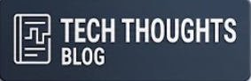

## Hi there, I'm Muharrem Bozkuş! 👋

<!--
**muharrembozkus/muharrembozkus** is a ✨ _special_ ✨ repository because its `README.md` (this file) appears on your GitHub profile.

Here are some ideas to get you started:

- 🔭 I’m currently working on ...
- 🌱 I’m currently learning ...
- 👯 I’m looking to collaborate on ...
- 🤔 I’m looking for help with ...
- 💬 Ask me about ...
- 📫 How to reach me: ...
- 😄 Pronouns: ...
- ⚡ Fun fact: ...
-->

  
  
  
  

---

## About Me

I am a technology leader and **Senior IT Manager** with nearly two decades of experience leading large-scale IT transformations, cloud migration programs, and enterprise infrastructure operations.

My work sits at the intersection of **Enterprise IT, Cloud Infrastructure, Platform Engineering, and Artificial Intelligence**. I focus on building resilient, scalable, secure, and cost-efficient technology environments while modernizing legacy platforms and improving operational efficiency.

I have worked across telecommunications, data centers, and complex enterprise environments, leading engineering teams and large-scale technology programs from strategy through execution.

**Areas of Expertise**
* **Cloud & Infrastructure Engineering:** Azure, VMware, Microsoft technologies, Cisco networking, virtualization, and data center platforms
* **Platform Engineering & Automation:** Kubernetes, OpenShift, infrastructure automation, container platforms, and modern operating models
* **Enterprise Modernization:** Cloud migration, application modernization, legacy transformation, and infrastructure lifecycle management
* **AI Infrastructure & Enterprise AI:** AI ready infrastructure, private AI platforms, LLM infrastructure, and AI driven IT automation
* **Cybersecurity & Resilience:** Infrastructure security, disaster recovery, business continuity, risk management, and IT governance

---
